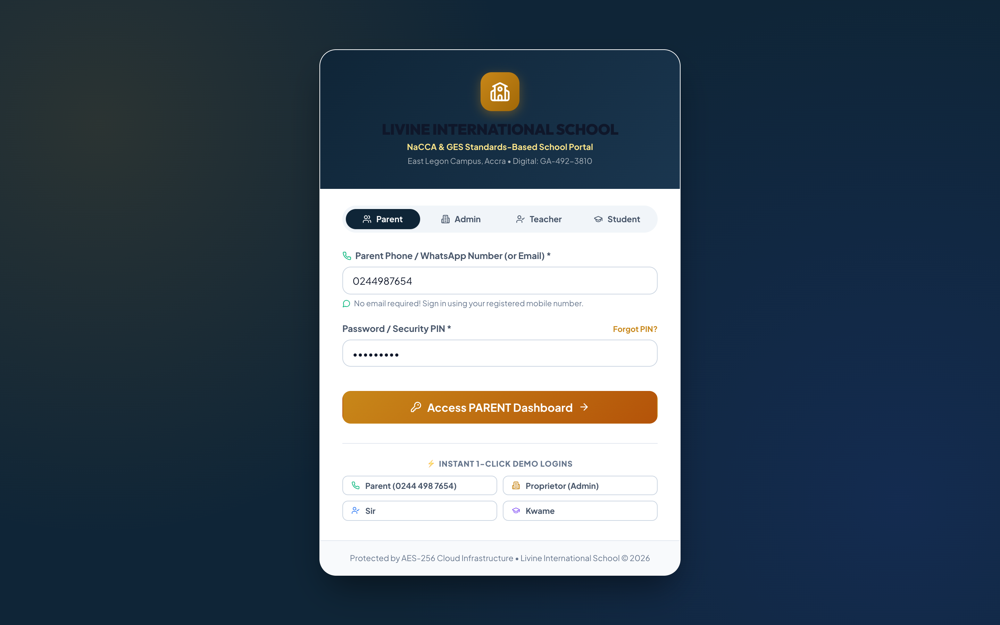
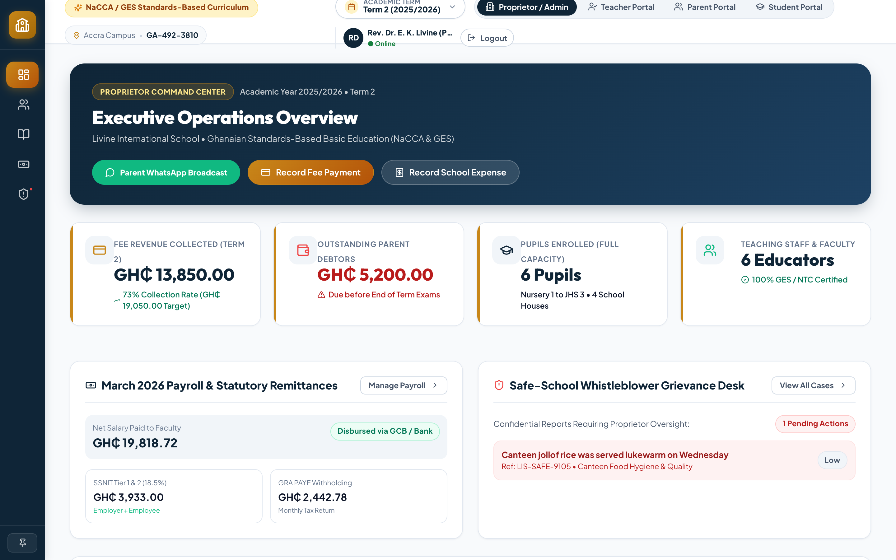
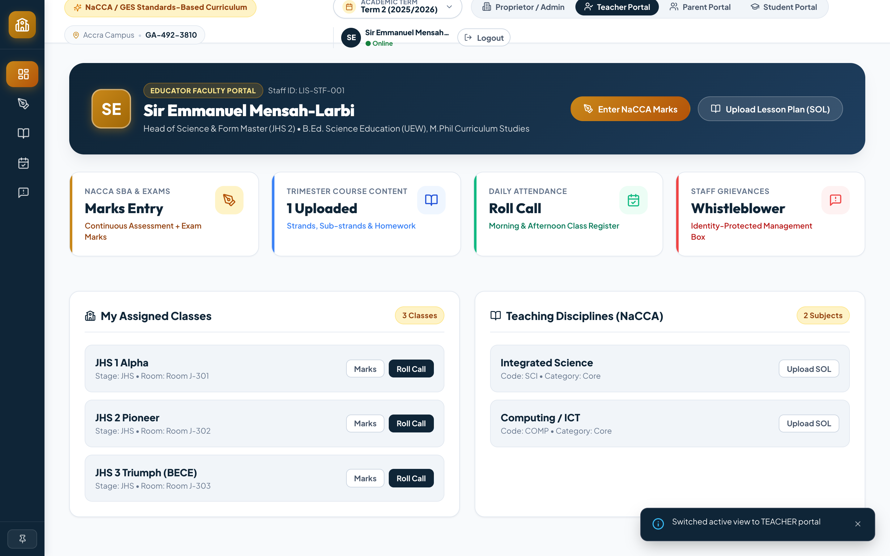
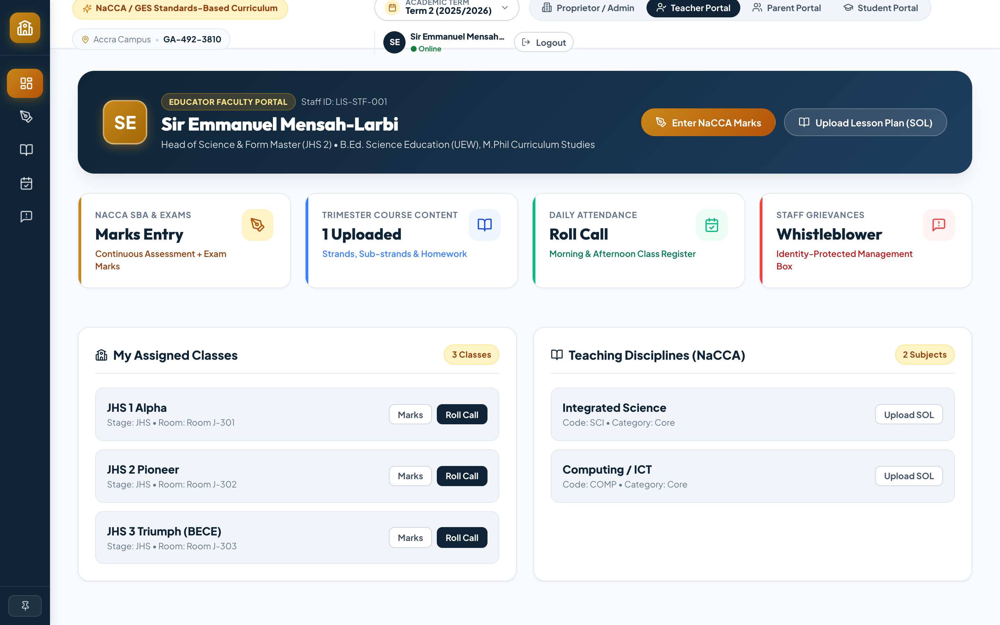
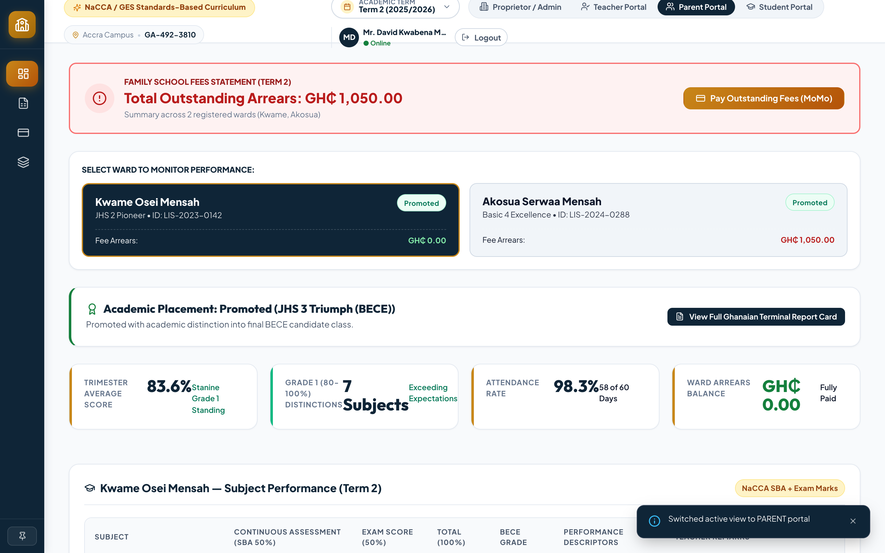
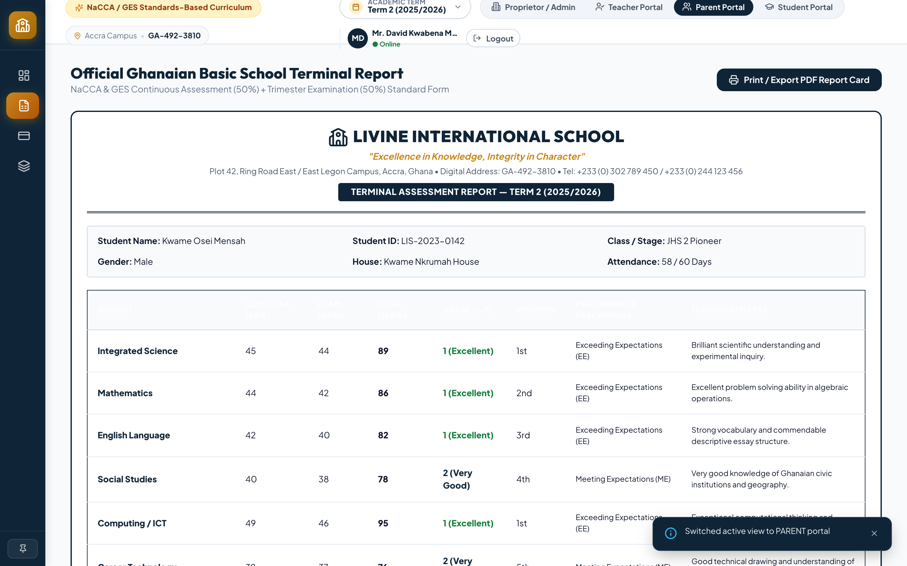
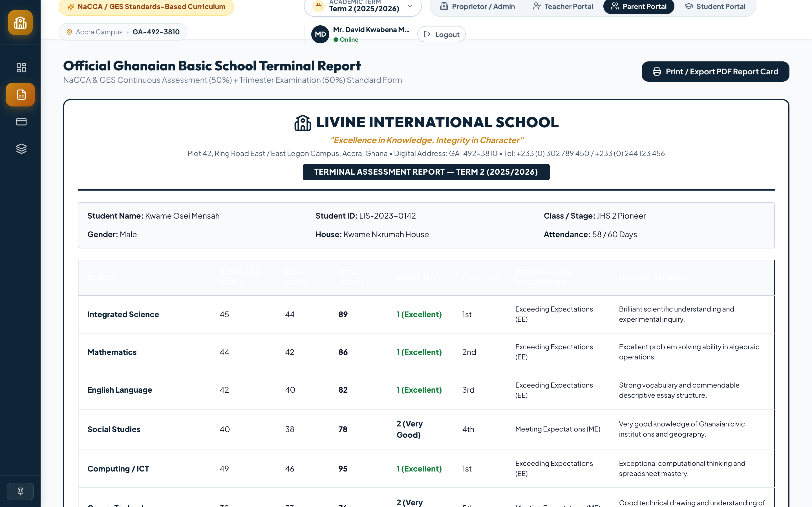
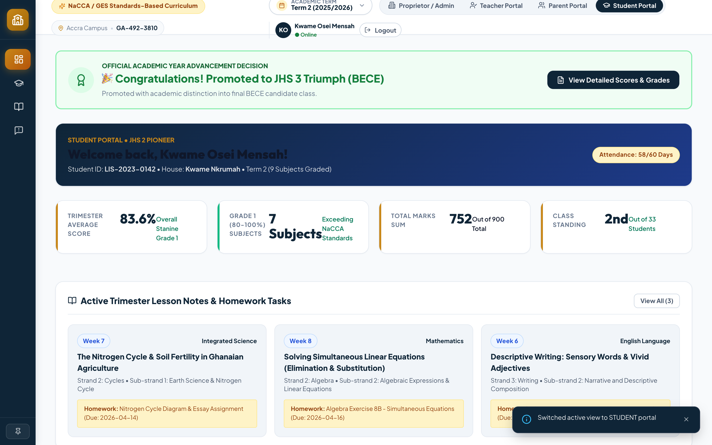

# 🇬🇭 Livine International School — Comprehensive System User Manual
**Ghanaian Basic Education Curriculum (NaCCA & GES Standards-Based)**  
*East Legon Campus, Accra, Ghana • Digital Address: GA-492-3810*  
*Online Portal:* [https://livine-school-management.vercel.app](https://livine-school-management.vercel.app)

---

## 📑 Table of Contents
1. [Executive Overview & School Architecture](#1-executive-overview--school-architecture)
2. [Multi-Role Authentication & Access Portals](#2-multi-role-authentication--access-portals)
3. [Proprietor & Administrator Command Center](#3-proprietor--administrator-command-center)
   - 3.1 [Executive Operations Dashboard](#31-executive-operations-dashboard)
   - 3.2 [People & Staffing Hub (Student Directory & Faculty Appointments)](#32-people--staffing-hub)
   - 3.3 [Annual Pupil Promotions Engine](#33-annual-pupil-promotions-engine)
   - 3.4 [Ghanaian Basic Education Fee Tariff & Debtors Ledger](#34-fee-tariffs--debtors-ledger)
   - 3.5 [Official Fee Payment Receipts (`LIS-REC-XXXX`)](#35-official-fee-payment-receipts)
   - 3.6 [1-Click WhatsApp Direct Reminders & Announcements Hub](#36-whatsapp-direct-reminders--broadcast-hub)
   - 3.7 [Staff Payroll, SSNIT (5.5%/13.5%) & GRA PAYE Tax Remittances](#37-staff-payroll--statutory-ssnitgra-tax)
   - 3.8 [Official Staff Monthly Payslip Advice](#38-official-staff-monthly-payslips)
   - 3.9 [General Journal Operating Expenses & P&L Statement](#39-operating-expenses--pl-statement)
   - 3.10 [Academics & NaCCA Curriculum Management](#310-academics--nacca-curriculum-management)
   - 3.11 [Superuser Access & Role-Based Security Delegations](#311-superuser-access--role-delegations)
4. [Teaching Faculty Portal](#4-teaching-faculty-portal)
   - 4.1 [Faculty Overview & Form Master Dashboard](#41-faculty-overview--form-master-dashboard)
   - 4.2 [NaCCA 50% SBA + 50% Exam Marks Entry & Grading System](#42-nacca-marks-entry--grading-system)
   - 4.3 [Weekly Schemes of Learning & Lesson Content Repository](#43-weekly-schemes-of-learning-uploads)
   - 4.4 [Digital Daily Class Attendance Register](#44-digital-daily-attendance-register)
   - 4.5 [Educator & Staff Safe-Reporting Box](#45-educator--staff-safe-reporting-box)
5. [Parent & Guardian Portal](#5-parent--guardian-portal)
   - 5.1 [Phone & WhatsApp Login (No Email Required)](#51-phone--whatsapp-login)
   - 5.2 [Ward Academic Performance & Rank Tracking](#52-ward-academic-performance)
   - 5.3 [Official Ghanaian Terminal Report Card & PDF Printing](#53-official-ghanaian-terminal-report-card)
   - 5.4 [MTN MoMo, Telecel Cash & Bank Fee Payments](#54-momo--bank-fee-payments)
   - 5.5 [Ward Weekly Curriculum & Homework Access](#55-ward-weekly-curriculum--homework)
6. [Student & Pupil Portal](#6-student--pupil-portal)
   - 6.1 [Pupil Results & BECE Grade Tracker](#61-pupil-results--bece-grade-tracker)
   - 6.2 [Weekly Lesson Notes & Task Downloads](#62-lesson-notes--task-downloads)
   - 6.3 [Pupil Safe-Space Anonymous Reporting Desk](#63-pupil-safe-space-anonymous-reporting)
7. [Safe-School Anonymous Whistleblower Case Tracker](#7-safe-school-anonymous-whistleblower-case-tracker)
8. [Data Export Utility (CSV / Excel)](#8-data-export-utility)
9. [Appendix: Ghanaian Standards Reference](#9-appendix-ghanaian-standards-reference)
   - A. [NaCCA / BECE 9-Point Stanine Grading Matrix](#a-nacca--bece-9-point-stanine-grading-matrix)
   - B. [Ghana Statutory Payroll Formulas (SSNIT Tier 1 & GRA PAYE)](#b-ghana-statutory-payroll-formulas)

---

## 1. Executive Overview & School Architecture

**Livine International School Management System** is a next-generation, cloud-native school enterprise management platform tailored to the **Ghana Basic Education Curriculum (NaCCA & GES Standards-Based)**. 

### Key System Capabilities:
- **Comprehensive Class Stages**: Nursery 1 & 2, Kindergarten 1 & 2 (Early Childhood), Basic 1 to 6 (Primary), and JHS 1 to 3 (Basic 7 to 9 / BECE Candidate Class).
- **Standards-Based Assessment**: Automated 50% Continuous Assessment (SBA: Class Tests, Group Projects, Homework) + 50% End of Term Examination.
- **Accredited 9-Point Stanine Scale**: Automatic grade computation from Grade 1 (Highest / 80–100%) to Grade 9 (Lowest / 0–34%).
- **Double-Entry Ghanaian School Accounting**: Tuition fee schedules, MTN MoMo/Telecel Cash receivables, 19.0% total SSNIT pensions, GRA progressive PAYE taxes, and GAAP Profit & Loss accounts.
- **Direct WhatsApp Parent Communication**: Instant single-click payment reminders and broadcast circulars.
- **100% Anonymous Safe-School Whistleblower Tracker**: Direct disciplinary oversight for bullying, safety, and staff welfare.

---

## 2. Multi-Role Authentication & Access Portals

The application provides four customized user environments with strict role-based access control (RBAC).

### Default User Credentials for Live Testing:

| Portal Role | Primary Identifier | Password | Default Demo Account |
| :--- | :--- | :--- | :--- |
| **Parent / Guardian** | **Mobile / WhatsApp Number** (`0244987654`) or Email | `parent123` | *Mr. David Kwabena Mensah* |
| **Proprietor / Admin** | Email (`admin@livine.edu.gh`) | `admin123` | *Rev. Dr. Livingstone / Principal* |
| **Teaching Faculty** | Staff ID (`LIS-STF-001`) or Email | `teacher123` | *Sir Peter Owusu-Ansah (Science Head)* |
| **Pupil / Student** | Student ID (`LIS-2023-0142`) | `student123` | *Kwame Osei Mensah (JHS 2)* |

> [!TIP]
> **1-Click Instant Demo Login:** On the login screen, click any of the 4 quick demo buttons at the bottom to sign in instantly without typing credentials.

---

## 3. Proprietor & Administrator Command Center

### 3.1 Executive Operations Dashboard
The Proprietor Command Center provides a high-level operational overview of school metrics:
- **Fee Revenue Collected**: Live active term fee intake vs. projected total billing targets.
- **Debtors Arrears**: Outstanding balances across all class levels requiring follow-up before trimester examinations.
- **Capacity & Enrolment**: Total pupils enrolled across 13 classes and 4 school houses (*Kwame Nkrumah, Yaa Asantewaa, Okomfo Anokye, Kwegyir Aggrey*).
- **Statutory Monthly Payroll**: Summary of Gross Salaries, 5.5% Employee SSNIT, 13.5% Employer SSNIT, and GRA PAYE tax remittances.
- **Whistleblower Oversight**: Active queue of anonymous complaints flagged for proprietor review.

---

### 3.2 People & Staffing Hub
Navigate to **People & Staff** from the left sidebar to manage the school directory.

#### Student Directory:
- View pupil biodata, class placement, residential address, parent phone numbers, and house assignments.
- Search by student name, admission number (`LIS-2023-XXXX`), or filter by class (Nursery to JHS 3).
- **Enroll New Pupil**: Add admission details, date of birth, guardian phone, and residential address.

#### Teaching Faculty & Form Masters:
- Manage teacher appointments, NTC/GES certifications, assigned disciplines, and basic monthly salaries.

---

### 3.3 Annual Pupil Promotions Engine
Navigate to **People & Staff $\to$ Promotions**:
- Batch evaluate student promotion decisions based on annual cumulative academic performance.
- Mark students as **Promoted**, **Repeated**, or **Probation**.
- 1-click batch promotion automatically transitions pupils to the next academic stage (e.g. Basic 6 $\to$ JHS 1).

---

### 3.4 Ghanaian Basic Education Fee Tariff & Debtors Ledger
Navigate to **Finance & Accounts $\to$ Student Fees Ledger**:
- Displays the approved GES/NaCCA fee tariffs for each stage:
  - **Nursery / KG**: Tuition, Feeding/Canteen, TLMs, and Facility Levy.
  - **Primary & JHS**: Tuition, Science/ICT Lab, PTA Levy, and Bus Transport.
- Real-time **Debtors Aging Matrix**: Identifies partial payers and overdue balances.

---

### 3.5 Official Fee Payment Receipts (`LIS-REC-XXXX`)
- Click **"Record Fee"** to enter a payment received via MTN Mobile Money, Telecel Cash, Bank Deposit, or Bursary Cash.
- Click **"Receipt"** on any payment row to open and print the **Official School Receipt Voucher**.
- Includes payment reference, amount paid, student arrears balance, and Accounts Officer circular seal.

---

### 3.6 1-Click WhatsApp Direct Reminders & Announcements Hub
- In the Debtors Ledger, click the green **"WhatsApp"** button on any debtor row.
- Opens a pre-composed official fee reminder with the exact outstanding arrears, MoMo merchant number (`059 123 4567`), and deadline.
- Click **"Launch WhatsApp Chat"** to open WhatsApp Web / App directly.
- **Bulk WhatsApp Broadcast**: Send general announcements, examination timetables, and PTA meeting circulars to all parents with one click.

---

### 3.7 Staff Payroll, SSNIT (5.5%/13.5%) & GRA PAYE Tax
Navigate to **Finance & Accounts $\to$ Staff Payroll & SSNIT**:
- Automated calculation of Ghanaian statutory payroll:
  - **Gross Salary** = Basic Salary + Responsibility/Housing/Transport Allowances.
  - **SSNIT Tier 1 & 2 (Employee 5.5%)**: Withheld from staff salary.
  - **SSNIT Tier 1 (Employer 13.5%)**: Direct school contribution (Total 19.0% SSNIT).
  - **GRA PAYE Monthly Withholding Tax**: Progressive Ghanaian income tax brackets.
  - **Net Salary Disbursed**: Final bank transfer amount.

---

### 3.8 Official Staff Monthly Payslip Advice
- Click **"Payslip"** next to any educator's name to generate the official monthly payslip.
- Displays full statutory breakdown, SSNIT number, disbursing bank account, and school payroll stamp.

---

### 3.9 Operating Expenses & P&L Statement
- Record school operating expenses (ECG electricity, GWCL water, bus fuel, janitorial supplies, laboratory consumables).
- Generates an automated GAAP/IFRS compliant **Profit & Loss Statement** for the academic term.

---

### 3.10 Academics & NaCCA Curriculum Management
Navigate to **Academics** from the sidebar:
- Configure NaCCA basic curriculum disciplines (*English, Mathematics, Integrated Science, Computing/ICT, Social Studies, RME, Asante Twi, French, Creative Arts & Design, Career Technology*).
- Review weekly Schemes of Learning, lesson notes, and uploaded homework tasks submitted by faculty.

---

### 3.11 Superuser Access & Role Delegations
Navigate to **People & Staff $\to$ Superusers**:
- Delegate granular administrative permissions to Vice Principals, Bursars, and Form Masters:
  - *Fee Tariff Management*
  - *Payroll & Financial Access*
  - *Admissions & Enrolment*
  - *Curriculum Scheme Approvals*
  - *Annual Promotions*

---

## 4. Teaching Faculty Portal

### 4.1 Faculty Overview & Form Master Dashboard
Sign in as a teacher (e.g. `LIS-STF-001` / `teacher123`). The teacher dashboard displays assigned classes, subjects, today's schedule, and pending mark submissions.

---

### 4.2 NaCCA 50% SBA + 50% Exam Marks Entry & Grading System
Navigate to **Marks Entry** from the top navbar:
1. Select the **Class / Stage** and **Subject**.
2. Enter the Continuous Assessment components:
   - **Class Test 1** (15 marks)
   - **Class Test 2** (15 marks)
   - **Group / Individual Project** (10 marks)
   - **Homework / Assignment** (10 marks)
   - $\to$ **Total SBA (50%)** computed automatically.
3. Enter the **End of Term Exam** (50 marks).
4. System automatically computes:
   - **Total Overall Score** (100%)
   - **BECE 9-Point Stanine Grade** (Grade 1–9)
   - **NaCCA Descriptor** (*Exceeding Expectations, Meeting Expectations, Approaching Expectations, Developing, Emerging*)
   - **Position in Subject & Class Rank**
5. Add personalized formative teacher remarks and click **"Save Mark Entries"**.

---

### 4.3 Weekly Schemes of Learning Uploads
Navigate to **Lesson Content**:
- Upload weekly teaching modules conforming to NaCCA Strands and Sub-strands.
- Add lesson notes, core competencies, and attach homework assignments with due dates.

---

### 4.4 Digital Daily Attendance Register
Navigate to **Attendance Register**:
- Take morning roll call for your assigned homeroom class.
- Mark students as **Present**, **Absent**, **Late**, or **Excused**.
- Attendance totals feed directly into the student's Terminal Report Card.

---

### 4.5 Educator & Staff Safe-Reporting Box
Navigate to **Safe-Reporting Box**:
- Submit confidential workplace observations or infrastructure requests directly to the Proprietor without identity logging.

---

## 5. Parent & Guardian Portal

### 5.1 Phone & WhatsApp Login (No Email Required)
Parents sign in using their registered Ghanaian mobile phone number (e.g. `0244987654` or `+233 24 498 7654`) with password `parent123`.

---

### 5.2 Ward Academic Performance & Rank Tracking
The Parent Dashboard provides an overview of all wards enrolled at Livine International School:
- Select between multiple children with 1 click.
- View current term average score, class position, attendance rate, and fee balance status.

---

### 5.3 Official Ghanaian Terminal Report Card & PDF Printing
Navigate to **Terminal Report**:
- Comprehensive official Ghanaian terminal report card.
- Subject-by-subject NaCCA Continuous Assessment breakdown (50% SBA + 50% Exam).
- Form Tutor and Headmaster comments, promotion recommendations, and reopening dates.
- Click **"Print Report Card"** to print or export as an official PDF document.

---

### 5.4 Mobile Money (MTN MoMo / Telecel) & Bank Fee Payment
Navigate to **Pay Fees**:
- View the itemized fee tariff breakdown for your child's class.
- Pay fees using **MTN Mobile Money**, **Telecel Cash**, or **Bank Deposit**.
- Instant official receipt generation with transaction tracking code.

---

### 5.5 Ward Weekly Curriculum & Homework Access
Navigate to **Curriculum & Homework**:
- Download weekly lesson notes, reading guides, and homework assignment instructions assigned by teachers.

---

## 6. Student & Pupil Portal

### 6.1 Pupil Results & BECE Grade Tracker
Pupils log in with their Student ID (e.g. `LIS-2023-0142` / `student123`):
- View term marks, Stanine grades, and subject mastery badges.

---

### 6.2 Lesson Notes & Task Downloads
- Access learning materials and study guides prepared by subject teachers.

---

### 6.3 Pupil Safe-Space Anonymous Reporting Desk
- Pupils can safely report bullying, unfair treatment, or security concerns.
- Generates an encrypted tracking ticket PIN (e.g. `LIS-SAFE-STU-4821`).

---

## 7. Safe-School Anonymous Whistleblower Case Tracker

Both students and teachers receive a secret **Ticket Reference PIN** upon lodging a confidential safe-report.

### How to Track a Case:
1. Open the **Case Tracker** tab at the bottom of the complaint box.
2. Enter your Ticket Code (e.g. `LIS-SAFE-STU-4821`).
3. Click **"Check Status"**.
4. Review the administration's investigation notes, actions taken, and submit anonymous follow-up evidence.

---

## 8. Data Export Utility (CSV / Excel)

All major datasets can be exported with 1 click:
- **Pupil Master Registry**: `exportStudentsToCSV(students)`
- **Debtors Arrears & Aging Report**: `exportDebtorsToCSV(...)`
- **Staff Payroll & SSNIT/GRA Tax Report**: `exportPayrollToCSV(...)`
- **BECE Registration Candidates List (Basic 9 / JHS 3)**: `exportBeceCandidatesToCSV(students)`

---

## 9. Appendix: Ghanaian Standards Reference

### A. NaCCA / BECE 9-Point Stanine Grading Matrix

| Marks Range (%) | Stanine Grade | NaCCA Proficiency Descriptor | Formative Remark |
| :---: | :---: | :--- | :--- |
| **80% – 100%** | **Grade 1** | Exceeding Expectations (EE) | Excellent |
| **75% – 79%** | **Grade 2** | Meeting Expectations (ME) | Very Good |
| **70% – 74%** | **Grade 3** | Meeting Expectations (ME) | Good |
| **65% – 69%** | **Grade 4** | Meeting Expectations (ME) | Credit |
| **60% – 64%** | **Grade 5** | Approaching Expectations (AE) | Credit |
| **55% – 59%** | **Grade 6** | Approaching Expectations (AE) | Pass |
| **50% – 54%** | **Grade 7** | Developing (D) | Pass |
| **40% – 49%** | **Grade 8** | Developing (D) | Weak Pass |
| **0% – 39%** | **Grade 9** | Emerging (E) | Needs Urgent Improvement |

---

### B. Ghana Statutory Payroll Formulas

1. **SSNIT Tier 1 & 2 (Employee Contribution)**:
   $$\text{Employee SSNIT} = \text{Basic Salary} \times 5.5\%$$
2. **SSNIT Tier 1 (Employer Contribution)**:
   $$\text{Employer SSNIT} = \text{Basic Salary} \times 13.5\%$$
   $$\text{Total Mandatory SSNIT Pension} = \text{Basic Salary} \times 19.0\%$$
3. **GRA PAYE Monthly Income Tax (2025/2026 Withholding Brackets)**:
   - First GH₵ 490.00: **Free (0%)**
   - Next GH₵ 110.00: **5%**
   - Next GH₵ 130.00: **10%**
   - Next GH₵ 3,166.67: **17.5%**
   - Next GH₵ 16,000.00: **25%**
   - Next GH₵ 30,520.00: **30%**
   - Exceeding GH₵ 50,000.00: **35%**

---

*Livine International School Management System • Developed with Excellence & Integrity*
